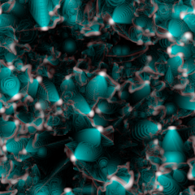

# Physical Cellular Automata
###### Note that this is a work in progress and will change or freeze in time in it's current state.

## Colabs
  
[Physical Cellular Automata - Simple notebook](https://colab.research.google.com/github/ekgren/physical-cellular-automata/blob/main/colabs/Physical_Cellular_Automata_Simple.ipynb)

## Introduction
  

## References